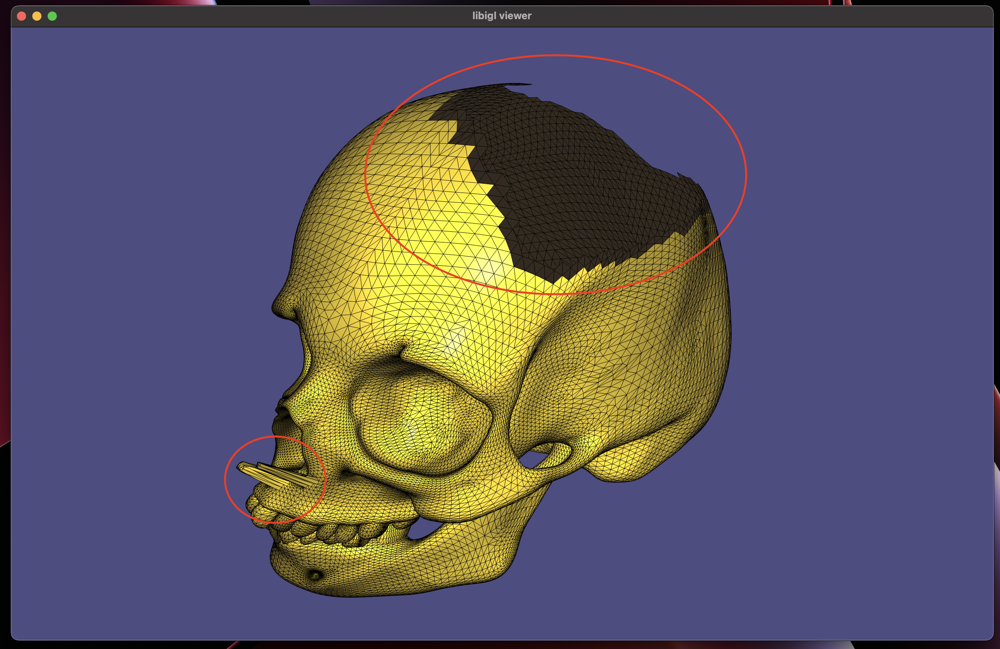

# Phong Deformation Implementation

Computing physics-based deformations on large objects can be very computationally expensive. Phong deformation aims to solve this cost issue by allowing the transfer/interpolation of deformations from a simpler tetrahedron mesh, to a more complex mesh. Each point in the full size mesh must be contained by a tetrahedron in the tetrahedral mesh. The

The deformation is performed by approximating the (unknown deformation function) using a cell-centroid deformation gradient and a cell-to-vertex gradient, then blending the results together. The cell-centroid deformation gradient is computed at the centroid of the tetrahedral cell that contains the query point, then that half of the phong deformation is computed using a linear interpolation based on the barycentric coordinates of the query point. The cell-to-vertex gradient is computed as a weigted sum of adjacent cell gradients, with the weights calculated based on the lengths of the vectors from the query point to the adjacent centroids. 

[

## Method

### 1. Tetrahedral Embedding

The first step is to create a tetrahedral mesh that encapsulates the full sized mesh. This can be done using a [tetrahedralizer pluggin](https://github.com/matthias-research/pages/blob/master/tenMinutePhysics/BlenderTetPlugin.py) for Blender. Sometimes processing is required (such as decimation) on the mesh prior to using the plugin to reduce the number of tetrahedral vertices. For shapes with concave geometry, the plugin produces sub par meshes; either a vertex is not in a cell, or a cell stretches across the convave region resulting in poor deformation. 


The `phong` program takes as input the fullsize (triangle) mesh and the tetrahedral mesh, as `.obj` files. The first step of the program is to find a containing tetrahedron for every point. This is done in the `find_tet` function. This needs to performed only once at the start of the program, but by far takes the longest time.


### 2. Phong deformation

The cell gradients are computed in `cell_def_gradient.h`. These gradients are used for both the cell centroid linear interpolation and blended cell-to-vertex interpolation. The cell-to-vertex gradients are computed (using output from `find_tet` and `cell_def_gradient`) in `vertex_def_gradient.h`. These functions are called from `phong_deformation_mesh.h` which computes the deformation approximations from the gradients and blends them:


## Demo

When running the `phong` program, the first thing displayed is the fullsize, undeformed mesh. Pressing `m`, the view can be switched to display the tetrahedral mesh.


The mesh isn't rendered well, as each 'face' in the object is a 3D shape. By pressing `x`, we can apply a deformation to the tetrahedral mesh:


This deformation is a 'twist' a round the y-axis; each point is rotated proportonally to its y-coordinate. Although this transformation is cheaper to compute on the full mesh than the phong deformation, it was used only for demostration purposes (it is also predictable). By pressing `[space]` we can switch to a view of the full mesh after phong deformation has been applied:


We can continue pressing `x`, which would further deform the tetrahedral mesh and perform phong deformation on the full mesh. We can reset the shape by pressing `r`.

This approach requires good tetrahedral embedding (Step 1), which is more of an art than a science. In the example above, the some vertices of the full mesh are outside any tetrahedra, resulting in the hull skull (in phong view), as well as artifacts. This could be reduced by refining the tetrahedral embedding process. 



By running

```bash
./phong data/suzanne.obj data/suzanne-tet.obj
```

You can see the phong deformation with less artifacts (it has better tetrahedral embedding):


